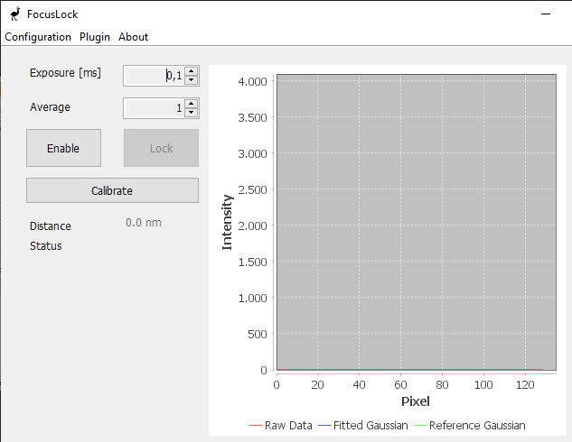

# Good Focus (gFocus)

**gFocus** is an active focus-lock system designed to maintain sharp focus during extended imaging experiments, such as single-molecule and live-cell imaging. It corrects axial drift (movement along the Z-axis) that can occur over time, ensuring your sample stays perfectly in focus.

This project is inspired by similar systems like qgFocus and pgFocus and follows the same naming convention.

## Key Features

- Real-time focus correction  
- Micro-Manager compatible  
- Flexible hardware support: works with any motorized Z-stage controllable through Micro-Manager  

## How It Works

1. An infrared laser beam is aimed slightly off-center into the objective lens.  
2. The beam reflects off the coverslip (glass slide) at the bottom of the sample.  
3. When the sample moves up or down (axial drift), the reflected beam shifts sideways.  
4. A light-array sensor detects this lateral shift by measuring the intensity profile of the reflected beam.  
5. The system calculates the amount of drift using a Gaussian fit to find the center of the beam.  
6. A feedback loop adjusts the Z-position of the stage to return the beam to its original position — restoring focus.  

## Getting Started

### Hardware Setup

1. In the `PCB` folder, you’ll find the **Gerber files** (for manufacturing the board), along with the **schematic** and **PCB design** in the `gFocus` folder. The project is designed using **KiCad**.  
2. A list of required components can be found in the **BOM (Bill of Materials)**.  
3. The mechanical design is available in the `enclosure` folder.

### Firmware Setup

1. gFocus uses the [XIAO SAMD21 microcontroller](https://nl.mouser.com/ProductDetail/Seeed-Studio/102010328?qs=GBLSl2AkirtQWO8CTzEK9g%3D%3D&srsltid=AfmBOoqHyFkl2Qpgyily5YNBzPaesjcrrXG1Ro79G8migozdgHgJccld).  
2. Follow this [getting started tutorial](https://wiki.seeedstudio.com/Seeeduino-XIAO/) to program the board using the `gFocus.ini` file.

### Software Setup

1. **Install Micro-Manager 2.0**  
   - Download and install the latest version of [Micro-Manager 2.0](https://download.micro-manager.org/nightly/2.0/Windows/).  
   - Copy the precompiled `EMU` folder (provided) into the root directory of Micro-Manager.

2. **Install the EMU Plugin** (for editing or customizing the interface)  
   - Follow the instructions here: [EMU Guide](https://jdeschamps.github.io/EMU-guide/)

3. **Install the gFocus Plugin**  
   - Copy the `gFocus.jar` file into the `EMU` folder in your Micro-Manager directory.

4. **Install the Device Adapter**  
   - Copy the `mmgr_dal_gFocus.dll` file into the root directory of Micro-Manager.  
   - To modify or rebuild the adapter:  
     - Follow the [Micro-Manager Visual Studio setup guide](https://micro-manager.org/Visual_Studio_project_settings_for_device_adapters)  
     - Place `.h` files in the **header** folder and `.cpp` files in the **source** folder.  
     - Compile the project and place the resulting `.dll` file into the Micro-Manager root directory.

## Usage

1. Connect the gFocus system to your PC using a USB-C cable.  
2. In Micro-Manager, go to **Device > Hardware Configuration Wizard** and create a new config file to only add `gFocus` and save it in `gFocus` folder in the root of Micro-Manager.  
3. Launch the plugin: **Plugins > User Interface > EMU** — the gFocus control panel will open. Ignore, the warning that it is not configured, `gFocus` runs on a sepperate MMCore instance.

You should see the following interface:

Now you're ready to go!

In the interface:
- You can adjust the **exposure time** and **averaging** for the light-array sensor.
- Press the `Enable` button to monitor pixel data from the sensor.
- Use the `Calibrate` button to run a calibration script that determines the relationship between pixel position and Z-distance.
- Once calibration is complete, the `Lock` button becomes available, activating the focus lock.

**Happy Imaging!**

## License

This project is licensed under the MIT License. See the `LICENSE` file for details.
